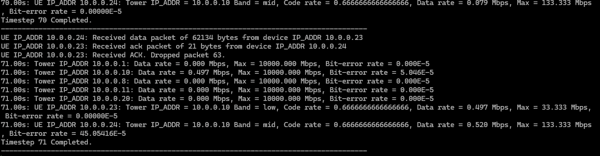

# cs576-group8-project
This project simulates 5G network activity. The key feature of this simulator is the fact that it implements the IPv4 protocol.

GUI Example:

CLI Example:

To run the code, install python 3.9.13. This code uses only built in python libraries including:
- tkinter
- math
- time
- random
- collections

Below highlights the features:
- Hexagonal Canvas
- Tower Status Control
- Tower Properties
- Backhaul Network visualization
- Placement and Mobility
- UE Property Panel
- Transmission Control
- Real-Time Simulation Controls
- Global Outage and Disablement
- Frequency Band Visualization
- Noise and interference Simulation
- Tower-UE Connection Visualization
- Throughput and Data-Rate Monitoring
- Automatic Handover Logic

### Introduction
This project presents an interactive 5G Network Simulator designed to help users visualize and experiment with the fundamental behaviors of modern cellular systems. Key features include full IPv4 support and a simple CLI backend for non GUI experiments. The simulator combines a real-time graphical interface with an underlying event-driven model that captures key aspects of 5G operation, including tower coverage, mobility, handovers, outages, and data transmission. By allowing users to place towers and UEs, adjust network conditions, and observe system responses, the tool provides an accessible way to study how network topology and radio characteristics affect performance. Although the simulator abstracts many complexities of the full 5G standard, it preserves the core mechanisms necessary for educational exploration. This report describes the simulator’s goals, features, modeling assumptions, user instructions, and experimental results to give a complete understanding of how the system operates and how it can be used for analysis.
